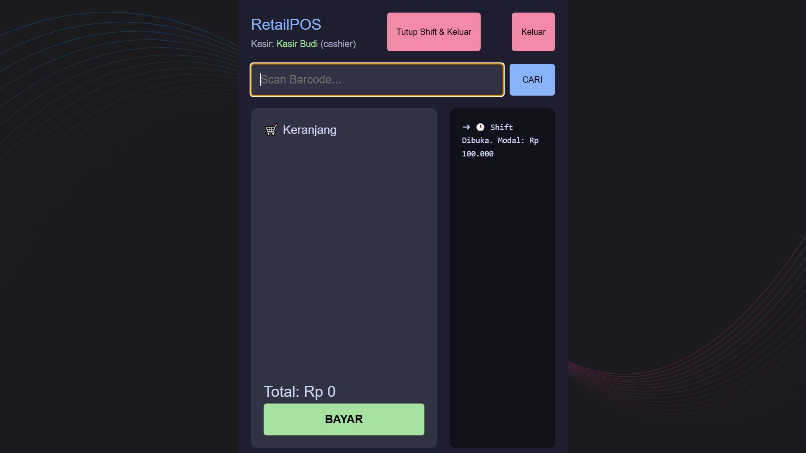
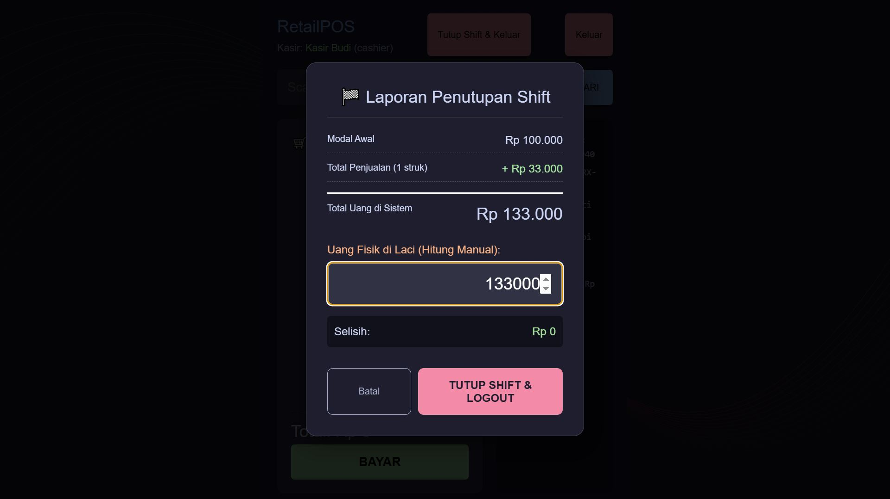
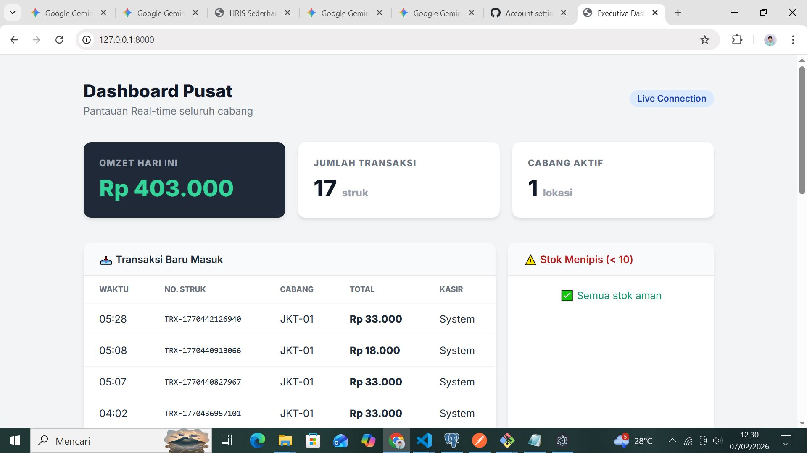
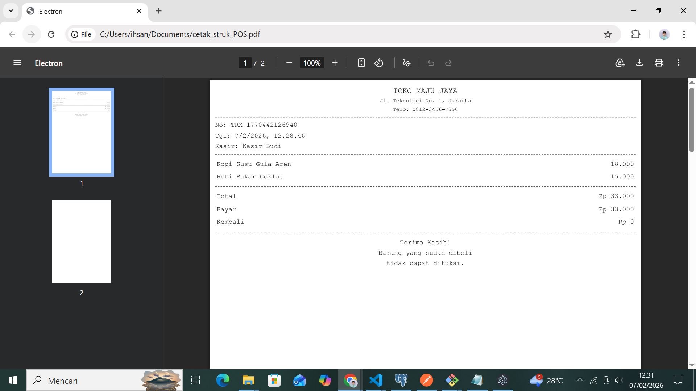

# 🛒 RetailPOS - Offline-First Hybrid Point of Sale System


## 📖 Overview

**RetailPOS** is a robust, production-ready Point of Sale (POS) system designed for retail businesses that face unstable internet connections. Built with a **Hybrid Architecture**, it combines the reliability of a desktop application with the centralized management of a web dashboard.

Unlike traditional web-based POS systems, RetailPOS continues to function 100% **Offline**. Cashiers can process transactions, print receipts, and manage shifts without internet. Data automatically synchronizes with the central cloud server (Laravel) once the connection is restored.

### 🌟 Key Features

- **🔌 Offline-First Architecture:** Transactions are stored locally in SQLite and synced to MySQL when online. No downtime during internet outages.
- **🔄 Smart Synchronization:** Two-way sync system (Down-sync for Stock/Products, Up-sync for Transactions/Shifts).
- **👮 Shift Management:** Complete cash control cycle (Open Shift -> Transaction -> Close Shift). Includes automatic variance calculation (System vs. Physical Cash).
- **🖨️ Thermal Printing:** Built-in PDF receipt generation optimized for 58mm thermal printers.
- **📊 Central Dashboard:** Web-based admin panel (Laravel) for real-time sales analytics, stock management, and cashier performance monitoring.
- **🔐 Secure Authentication:** PIN-based login for cashiers with Laravel Sanctum token integration.
- **📦 Windows Installer:** Packaged as a standalone `.exe` installer using Electron Builder.

## 🛠️ Tech Stack

### Desktop Client (POS)

- **Framework:** Electron (v28+)
- **Frontend:** React.js + Vite
- **Local Database:** SQLite (`better-sqlite3`)
- **Styling:** CSS Modules / Custom CSS
- **Build Tool:** Electron Builder (NSIS)

### Cloud Backend (Server)

- **Framework:** Laravel 10
- **Database:** MySQL
- **API:** RESTful API with Sanctum Authentication
- **Template Engine:** Blade (for Admin Dashboard)

## 🏗️ System Architecture

The system utilizes a **Dual-Database Strategy**:

1.  **Local (Edge):** Each POS machine runs an embedded **SQLite** database. This ensures instant response times (0ms latency) and offline capability.
2.  **Cloud (Central):** A **MySQL** database acts as the single source of truth.
3.  **The Sync Bridge:** A custom background process in Electron periodically pushes new transactions to the Cloud and pulls updated product prices/stocks to the Local DB.

## 📸 Screenshots

|                         POS Interface                         |                           Shift Closing Report                            |
| :-----------------------------------------------------------: | :-----------------------------------------------------------------------: |
|  |  |

|                              Admin Dashboard                              |                         Receipt Preview                         |
| :-----------------------------------------------------------------------: | :-------------------------------------------------------------: |
|  |  |

_(Note: Place your screenshots in a `screenshots` folder in your repository)_

## 🚀 Installation & Setup

This project consists of two parts: the **Backend** and the **Desktop App**.

### 1. Backend Setup (Laravel)

```bash
# Clone the repository
git clone [https://github.com/yourusername/retail-pos-system.git](https://github.com/yourusername/retail-pos-system.git)
cd retail-backend

# Install dependencies
composer install

# Setup Environment
cp .env.example .env
# (Configure your MySQL database credentials in .env)

# Generate Key & Migrate
php artisan key:generate
php artisan migrate --seed

# Serve the API
php artisan serve

2. Desktop App Setup (Electron)

cd retail-pos

# Install dependencies
npm install

# Rebuild SQLite for Electron (Important!)
npm run postinstall

# Run in Development Mode
npm run dev

3. Building the Executable (.exe)

# Ensure you are in the retail-pos directory
npm run build:win

The installer will be generated in the dist_installer folder.

🧪 Testing the Sync
Start the Laravel Server (php artisan serve).

Open the Electron App.

Go Offline: Disconnect your internet.

Transact: Make a sale. It will save to SQLite.

Go Online: Reconnect internet.

Verify: Check the Laravel Dashboard. The transaction will appear automatically.

📄 License
This project is open-sourced software licensed under the MIT license.

Created by Muhammad Azfa Asykarulloh. Check out my portfolio at github.com/spamathcodex
```
